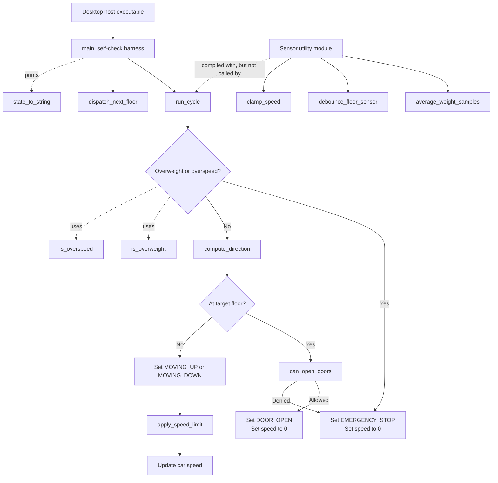

# Elevator Controller Architecture

## Purpose

This project is a desktop-buildable Embedded C model of an elevator car
controller. It demonstrates a polled control-loop design with fixed-width
types and no dynamic allocation. The executable also contains a self-check
harness so the firmware logic can be exercised on a development machine.

## Components

| Component | Responsibility |
| --- | --- |
| `src/elevator_controller.h` | Shared elevator state model, limits, and controller API. |
| `src/elevator_controller.c` | Controller decisions, state transitions, floor dispatch, desktop `main`, and self-checks. |
| `src/sensor_utils.h` | Sensor and numeric utility API. |
| `src/sensor_utils.c` | Weight averaging, floor-sensor debouncing, and speed clamping helpers. |
| `Makefile` | Builds both C modules into the `elevator_controller` host executable. |

## Runtime Control Flow

`run_cycle(elevator_t *car)` is the controller's decision point. Each tick
first evaluates load and speed safety limits. A fault forces an emergency
stop. Otherwise, the controller either stops at the target and evaluates the
door interlock, or chooses a travel state and applies an approach-speed limit.

## State and Safety Model

The `elevator_t` structure carries the car's current and target floor, current
state, speed, weight, and fault status. The controller exposes the following
operational states:

- `STATE_IDLE`
- `STATE_MOVING_UP`
- `STATE_MOVING_DOWN`
- `STATE_DOOR_OPENING`
- `STATE_DOOR_OPEN`
- `STATE_DOOR_CLOSING`
- `STATE_EMERGENCY_STOP`

The main safety rules are:

- Weight above `MAX_CAR_WEIGHT_KG` or speed above `MAX_SPEED_MM_S` activates a fault.
- An active fault stops the car and selects `STATE_EMERGENCY_STOP`.
- Doors may open only after the car reaches its target, is stationary, and has no fault.
- Speed is reduced as the car approaches its target floor.

## Sensor Utilities and Integration Boundary

`sensor_utils` is a separate utility module built into the executable. It
provides utility operations for acquiring stable sensor values and constraining
numeric values, but the current `run_cycle` implementation does not call it.
The controller is therefore driven by values already present in `elevator_t`.

In a target firmware integration, a hardware abstraction layer or polling task
would obtain raw readings, call `debounce_floor_sensor` and
`average_weight_samples`, update the `elevator_t` input fields, and then invoke
`run_cycle`. Actuator commands derived from the resulting state and speed would
be sent to the motor and door subsystems.

## Build and Verification

Run `make build` to compile the host executable or `make run` to execute its
self-check harness. The self-checks exercise controller helper functions and
the moving and arrived branches of `run_cycle`.

## Current Demo Caveat

Several functions intentionally contain stubs or defects for the training
exercise described in the project README. Until those exercises are completed,
the self-check harness is expected to report failures. The architecture above
documents the intended control flow implemented by the module interfaces and
`run_cycle` composition.